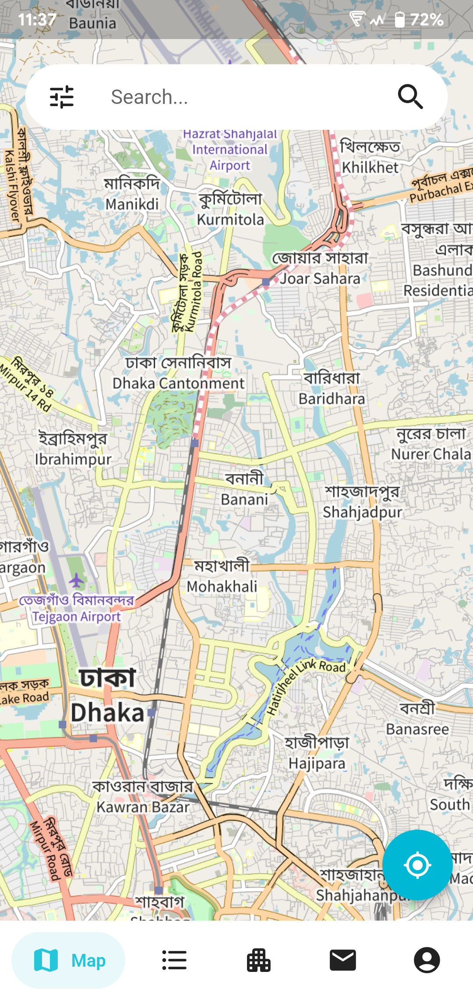
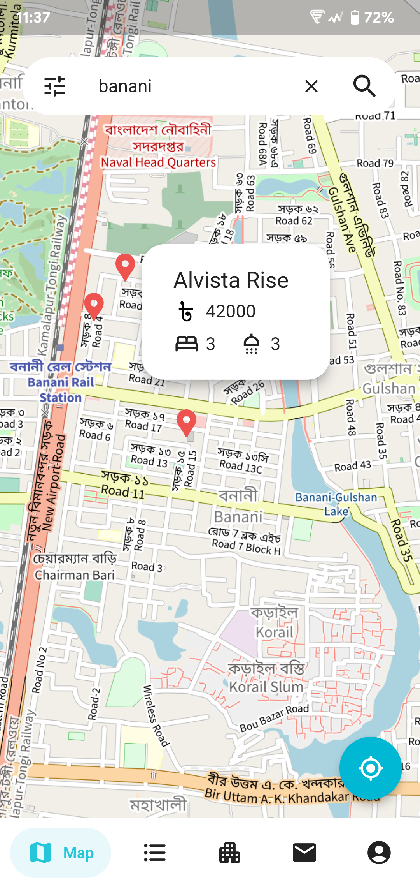
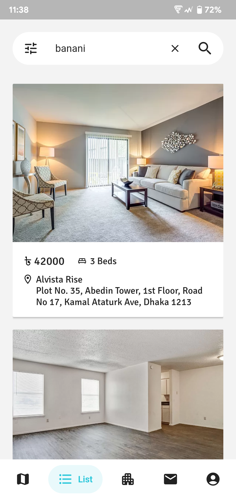
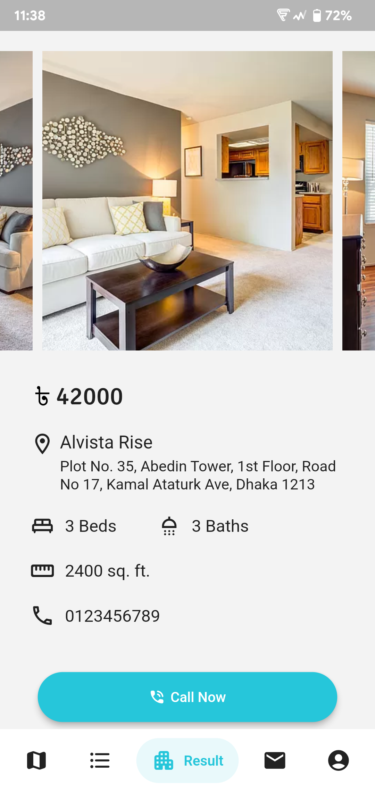
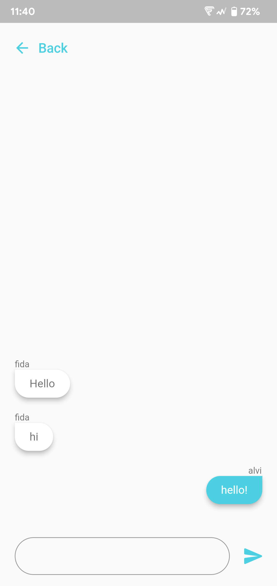
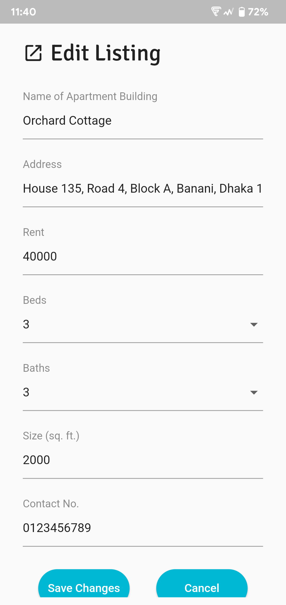

# House Hunter

House Hunter is a map-based rental listing searching app. It is built using Flutter and uses the Leaflet viewing library along with the Tracestrack tiles API, working with Firebase on the backend.

## Screenshots

  
  
  
  
  
  

## Features
* Search for rental listings using an interactive map.
* Search for rental listings based on your location.
* View listing details and images.
* Post new rental listings as a landlord.
* Communicate with landlords via in-app messaging system.

## Attribution
The logo for the application was provided by [Pixel perfect](https://www.flaticon.com/free-icon/love_3729617) on Flaticon.
